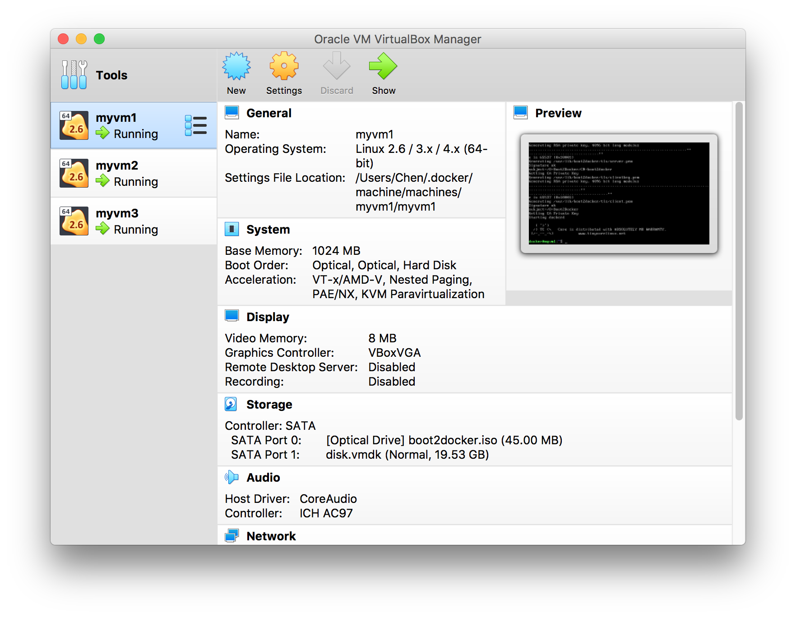
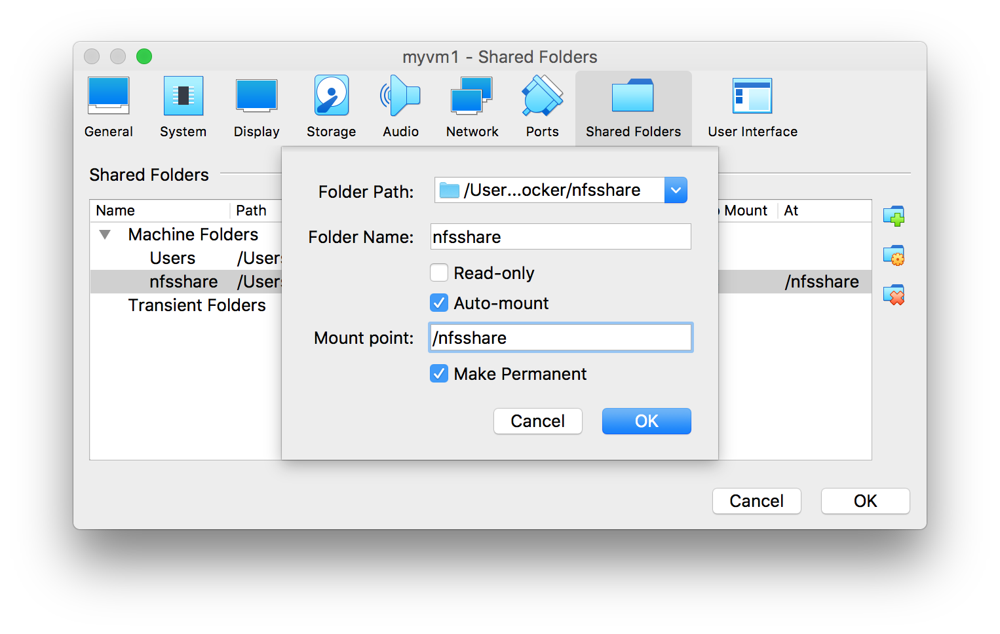
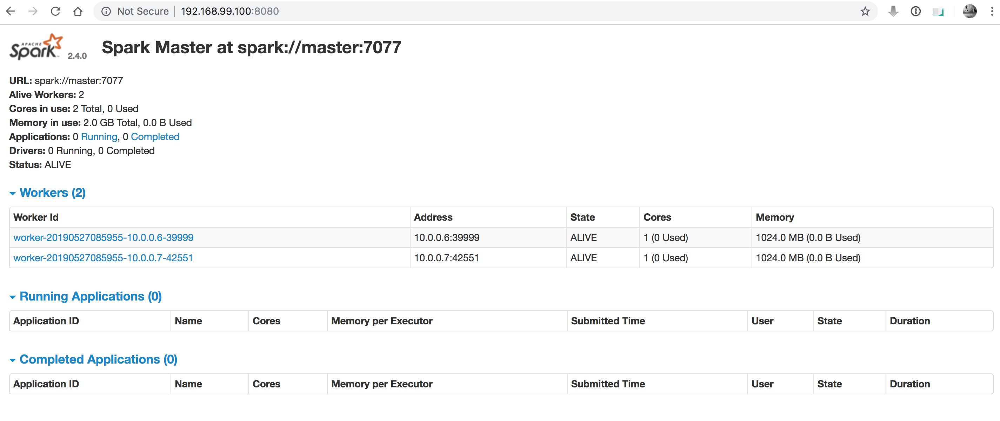

# Spark Cluster in Docker / Docker Swarm
This part is to deploy a spark cluster using docker swarm. Implemented in following steps.

1. Deploy spark cluster in docker containers
2. Deploy spark cluster in docker swarm (VM)
3. Using NFS to do the file sharing in all docker machines.
4. Submit and run tasks
5. Support start jupyter notebook in master / manager node.  

Code Repository: [spark-in-docker](https://github.com/cchencool/spark-in-docker)

## File Structure:

|         directory         |                         description                          |
| :-----------------------: | :----------------------------------------------------------: |
|            bin            | docker container mode scripts. All images startup in local machine. |
|           sbin            | Docker **swarm** deployment scripts. Spark nodes are deployed on docker machines |
|           code            |                        some test code                        |
|          docker           |      files to build docker image and docker-compose.yml      |
|       docker/config       |     configuration files for image building and services.     |
|        docker/pkg         | install packages for image building. Including spark / java / hadoop |
|      docker/setup.sh      | Script for manually setup other configurations. such as jupyter-notebook etc. |
|   docker/build-image.sh   |                  Script for image building                   |
|     docker/Dockerfile     |              Spark image. Base on Ubunut:18.04               |
| docker/docker-compose.yml |                spark services in docker swarm                |

## Detail

#### 1. Docker Image & Dockerfile

1. The image is based on ubuntu:18.04

2. Install some sofewares: vim, ssh, python3.6, jupyter

3. Configurate ssh trust with self

4. Install JDK & Spark thought local file. (Can also through internet.) 

   The install packages should be placed in `docker/pkg` directory according to `required_files.txt` in the same directory.  

5. Configurate environment variables.

6. Configurate Spark slaves. (This is only necessary when start multiple containers of this image in single machine)

7. Install necessary python packages according to file `docker/config/requirements.txt`.

8. Configurate SSH service.

9. Start SSH and waiting for further instructions.

#### 2. Service Stacks & docker-compose.yml

1. There are 2 services: master & worker. And they use the same image which compiled by the Dockerfile above.
2. Adjust the number of workers by change field `services-worker-deploy-replicas`
3. There an overlay network.
4. There is an docker volume: `/nfsshare:/root/nfsshare` which maps local `/nsfshare` folder to container `/root/nfsshare` folder.
5. To ensure the spark can work base on docker swarm, there are 2 options:
   1. - [ ] Using Hadoop with HDFS in docker swarm cluster.
   2. - [x] Using NFS to sync files in the cluster.
6. The container resources are configurable in `cpus` & `memory` fild.
7. The Spark resources are configurable by setting environment variables in `environment` fild. The variables' name can be found in [offical documents of Spark](https://spark.apache.org/docs/latest/spark-standalone.html)

#### 3. Scripts

**Scripts under `bin/`**

Scripts under this folder manage containers directly. And all images startup in local machine.

| Script                     | Usage                                                        |
| -------------------------- | ------------------------------------------------------------ |
| get-master-ip.sh           | Aquire the spark master node IP address.                     |
| resize-cluster.sh          | Change cluster size. Need to stop **ALL** containers before resize. |
| spark-container-service.sh | Entrance for service control. Follow command start, stop, status, usage. |
| spark-containers-start.sh  | Script for **start up** the container mode of spark cluster. |
| spark-containers-status.sh | Script for **checking status** of the container mode of spark cluster. |
| spark-containers-stop.sh   | Script for **stop** the container mode of spark cluster.     |

**Scripts under `sbin/`**

| Script                   | Usage                                                        |
| ------------------------ | ------------------------------------------------------------ |
| config-swarm.sh          | Configurate docker swarm environments. [*1]()                |
| spark-cluster-service.sh | Entrance for service control. Commands: deploy, remove, status, usage. |
| spark-cluster-deploy.sh  | Script for **start up** the spark cluster in docker swarm mode. |
| spark-cluster-status.sh  | Script for **checking status** of the spark cluster in docker swarm mode. |
| spark-cluster-remove.sh  | Script for **stop** the spark cluster in docker swarm mode.  |

*1: For now, the config-swarm script only support create docker machine in virtual box. If you want to run this on a real cluster of physical machines. You should manually configurate the docker machines on these machine, and adjust the script about the IP addresses.

*2: Normally, only need to use the entrance script to manage the spark cluster service (stacks).

#### 4. Guide of Usage

1. Normally, to take the advantage of Spark computation ability, you should run the spark in a real cluser. In this case, please using the script under `sbin/` to manage your cluster as docker swarm mode.

2. Running command `./config-swarm.sh --create --num=3 --prefix=myvm` to create a virtual environment of 3 machine cluster with [virtualbox](https://www.virtualbox.org/wiki/Downloads) as driver.

   

3. Configurate share folder (NFS, if physical machine) for your docker machines.

   

4. Run commad `docker-machine restart myvm1 myvm2 myvm3` to restart you docker machines. Making the shared folder effective.

5. By running command `docker-machine ls`, you can check the docker machines you created.

   ```
   ➜  sbin git:(master) docker-machine ls
   NAME    ACTIVE   DRIVER       STATE     URL                         SWARM   DOCKER     ERRORS
   myvm1   -        virtualbox   Running   tcp://192.168.99.100:2376           v18.09.6   
   myvm2   -        virtualbox   Running   tcp://192.168.99.101:2376           v18.09.6   
   myvm3   -        virtualbox   Running   tcp://192.168.99.102:2376           v18.09.6   
   ```

6. By runing the command `eval $(docker-machine env myvm1)`, you can manage your docker machines easier. Or connect your docker machine with command `docker-machine ssh myvm1`

   ```shell
   ➜  sbin git:(master) docker-machine env myvm1
   export DOCKER_TLS_VERIFY="1"
   export DOCKER_HOST="tcp://192.168.99.100:2376"
   export DOCKER_CERT_PATH="/Users/Chen/.docker/machine/machines/myvm1"
   export DOCKER_MACHINE_NAME="myvm1"
   # Run this command to configure your shell: 
   # eval $(docker-machine env myvm1)
   ➜  sbin git:(master) ✗ eval $(docker-machine env myvm1)
   ```

7. By running the command `./spark-cluster-service.sh deploy`, the service stacks should be startup and running now. The first time may cost some time for downloading the image.

   ```shell
   ➜  sbin git:(master) ✗ ./spark-cluster-service.sh deploy
   deploying spark...
   Creating network spark_spark-net
   Creating service spark_master
   Creating service spark_worker
   getting information...
      spark-master : 192.168.99.100:7077
            web UI : 192.168.99.100:8080
               data-dir-host : ./../nfsshare
             data-dir-master : /root/nfsshare
   to start jupyter notebook, run 'docker container exec -it spark_master.1* bash'; then run 'sh /root/install/setup.sh'
   jupyter-noteboo : 192.168.99.100:8888         
   ```

8. Using commands `./spark-cluster-service.sh status`  or  `docker stack ls` or `docker stack ps spark` or `docker service ls`  to check the services do startup. 

   Please notice ***REPLICAS*** field shows ***0/1*** or ***0/2*** and the CURRENT ***STATE*** is ***Preparing n minutes ago***. This is because it takes some time to **download the images** . The image size is **around 1GB**. And all docker machines will need to download the image respectively.

   ```shell
   ➜  sbin git:(master) ✗ ./spark-cluster-service.sh status
   check spark status...
   ID                  NAME                IMAGE                    NODE                DESIRED STATE       CURRENT STATE             ERROR               PORTS
   y98c8ywnckl9        spark_worker.1      cchencool/spark:latest   myvm3               Running             Preparing 7 minutes ago                       
   nf1gzikfybcw        spark_master.1      cchencool/spark:latest   myvm1               Running             Preparing 7 minutes ago                       
   twtjuuqdh8qj        spark_worker.2      cchencool/spark:latest   myvm2               Running             Preparing 7 minutes ago                       
   done
   ➜  sbin git:(master) ✗ docker stack ls         
   NAME                SERVICES            ORCHESTRATOR
   spark               2                   Swarm
   ➜  sbin git:(master) ✗ docker stack ps spark
   ID                  NAME                IMAGE                    NODE                DESIRED STATE       CURRENT STATE             ERROR               PORTS
   y98c8ywnckl9        spark_worker.1      cchencool/spark:latest   myvm3               Running             Preparing 8 minutes ago                       
   nf1gzikfybcw        spark_master.1      cchencool/spark:latest   myvm1               Running             Preparing 8 minutes ago                       
   twtjuuqdh8qj        spark_worker.2      cchencool/spark:latest   myvm2               Running             Preparing 8 minutes ago  
   ➜  sbin git:(master) ✗ docker service ls
   ID                  NAME                MODE                REPLICAS            IMAGE                    PORTS
   ot7ucdk904ne        spark_master        replicated          0/1                 cchencool/spark:latest   *:4040->4040/tcp, *:6066->6066/tcp, *:7077->7077/tcp, *:8080->8080/tcp, *:8888->8888/tcp
   f3k81ebll3ny        spark_worker        replicated          0/2                 cchencool/spark:latest   *:8081->8081/tcp
   ```

9. When the spark cluster successfully deployed, you should see ***DESIRED STATE*** becomes to ***Running*** and ***REPLICAS*** becomes to ***1/1*** and ***2/2***:

   ```shell
   ➜  sbin git:(master) ✗ ./spark-cluster-service.sh status
   check spark status...
   ID                  NAME                IMAGE                    NODE                DESIRED STATE       CURRENT STATE            ERROR               PORTS
   czie0i2ky43v        spark_worker.1      cchencool/spark:latest   myvm3               Running             Running 5 seconds ago                        
   khcidid7d44m        spark_master.1      cchencool/spark:latest   myvm1               Running             Running 11 seconds ago                       
   yw58robszmo9        spark_worker.2      cchencool/spark:latest   myvm2               Running             Running 5 seconds ago                        
   done
   ➜  sbin git:(master) ✗ docker service ls  
   ID                  NAME                MODE                REPLICAS            IMAGE                    PORTS
   n3u9w9ej1u12        spark_master        replicated          1/1                 cchencool/spark:latest   *:4040->4040/tcp, *:6066->6066/tcp, *:7077->7077/tcp, *:8080->8080/tcp, *:8888->8888/tcp
   ruufeky42eqi        spark_worker        replicated          2/2                 cchencool/spark:latest   *:8081->8081/tcp
   ```

10. Using the infomation printted out by the script to connect spark cluster. Checking the web UI.

    

11. You can connect to your container using commands below:

    ```shell
    ➜  sbin git:(master) ✗ ➜  sbin git:(master) ✗ docker container ls
    CONTAINER ID        IMAGE                    COMMAND                  CREATED             STATUS              PORTS               NAMES
    4239569e16e0        cchencool/spark:latest   "sh -c 'source ~/.ba…"   3 minutes ago       Up 3 minutes        7077/tcp            spark_master.1.khcidid7d44m32kcfdo8jf7ya
    ➜  sbin git:(master) ✗ docker container exec -it spark_master.1.khcidid7d44m32kcfdo8jf7ya bash
    root@master:~/workspace# ls -al
    total 16
    drwxr-xr-x 1 root root 4096 May 27 08:59 .
    drwx------ 1 root root 4096 May 27 09:03 ..
    -rw-r--r-- 1 root root  133 May 27 08:59 log
    root@master:~/workspace# pwd
    /root/workspace
    root@master:~/workspace# cat log 
    starting org.apache.spark.deploy.master.Master, logging to /opt/spark/logs/spark--org.apache.spark.deploy.master.Master-1-master.out
    ```

12. When you want to shut down the cluster, using the script `./spark-cluster-service.sh remove`.

    ```shell
    ➜  sbin git:(master) ✗ ./spark-cluster-service.sh remove
    removing spark...
    Removing service spark_master
    Removing service spark_worker
    Removing network spark_spark-net
    success
    ```

    

## Notice:

**Data upload**

1. For this demo implementation, just using docker-machine virtualBox as driver. You can directly shareing folder `/nfsshare` with host in the virtual box configuration to simulate the well configurated NFS environment.

2. Should use NFS in production. Shareing `/nfsshare` accross the hosts. This folder is also changeable by modifying the `volumes` of 2 services in the `docker-compose.yml` file.

**Task submission**

1. When use the `spark-cluster-service.sh deploy` command start the spark cluster in docker swarm, it should print out the spark-master, spark web UI addresses.
2. To run a task, no matter in Jupyter Notebook or a single driver program, simply follow the [Spark documentation](https://spark.apache.org/docs/latest/spark-standalone.html) to connect your driver to the spark master.
3. You should be aware and manage the CPU & Memory resources by yourself. To ensure multiple drivers are not blocked when running at same time, you should carefully configurate those resource limitation parameters of you driver programs to avoid running out of resources.

## References:
* [hadoop-cluster-docker](https://github.com/kiwenlau/hadoop-cluster-docker)
* [spark-docker-swarm](https://github.com/testdrivenio/spark-docker-swarm)